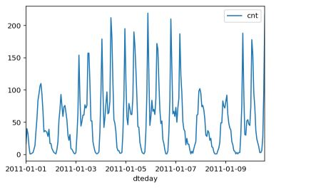

UDACITY DEEP LEARNING NANODEGREE - MY FIRST NN 
# BIKE SHARING 

## Introductions: 
In this project, you'll get to build a neural network from scratch to carry out a prediction problem on a real dataset! By building a neural network from the ground up, you'll have a much better understanding of gradient descent, backpropagation, and other concepts that are important to know before we move to higher level tools such as Tensorflow. You'll also get to see how to apply these networks to solve real prediction problems!

The data comes from the [UCI Machine Learning Database](https://archive.ics.uci.edu/ml/datasets/Bike+Sharing+Dataset).

## Results 

### Data
 

### Training curve

### Predictions: from 11.12 - 31.12 

## Feedback v1
**Hyperparameters**

The number of epochs is chosen such the network is trained well enough to accurately make predictions but is not overfitting to the training data.
Good effort here! :)
Please note that because of the high ylim and the small learn rate, it's hard to tell whether you converged or not, you'll probably going to have to reduce this number after inicreasing the learn rate.
Aim at around 0.1 for the validation and training loss.

Good luck! :)
The number of hidden units is chosen such that the network is able to accurately predict the number of bike riders, is able to generalize, and is not overfitting.
Well done! Good selection of number of hidden units :)
For future reference you can use this guide to determine a good number of hidden units - https://www.quora.com/How-do-I-decide-the-number-of-nodes-in-a-hidden-layer-of-a-neural-network

The learning rate is chosen such that the network successfully converges, but is still time efficient.
Good effort here! :) Please note that the effective learn rate is self.lr/n_records , not self.lr, so your current lr is 0.01/1440, it's too small. Please increase it by a factor of ~100-500.  
After the submission comments I understood the relaion between lr and training and I realized how to choose the right learning rate. 
0.01 / 1440 = 0.000714 
x / 1440 = 0.001 -> x = 1.4 
iterations = 4000  
  
12 test values:  lr=1.4; it=4000; hn=20    
12 test results: Training loss: 0.514 ... Validation loss: 0.621 => learning rate too high  
12 test values:  lr=0.7; it=6000; hn=20    
12 test results: Training loss: 0.053 ... Validation loss: 0.120  
tools to choose parameters: http://machinelearningmastery.com/grid-search-hyperparameters-deep-learning-models-python-keras/  
 Learning rate:  

## Instructions: 
1. Create a new conda environment: 
`conda create --name dlnd python=3 `

2. Enter your new environment:
`Mac/Linux: >> source activate dlnd `
` Windows: >> activate dlnd `

3. Ensure you have **numpy**, **matplotlib**, **pandas** and **jupyter notebook** installed by doing the folloiwng: 

`conda install numpy matplotlib pandas jupyter notebook`

4. open the notebook server: 
`jupyter notebook`

## What to do afterwards
If you're waiting for new content or to get the review back, here's a great video from [Frank Chen](https://vimeo.com/170189199) about the history of deep learning. It's a 45 minute video, sort of a short documentary, starting in the 1950s and bringing us to the current boom in deep learning and artificial intelligence.
